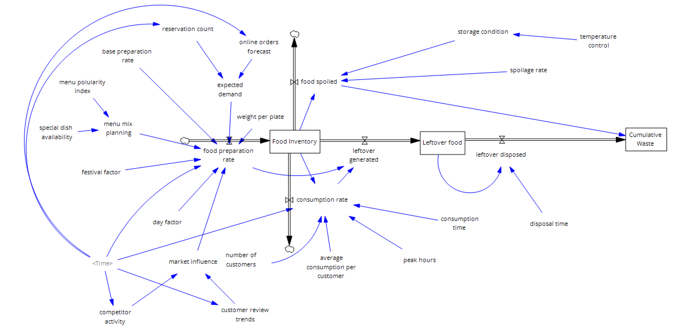

# 🍽️ Restaurant Digital Twin for Food Inventory & Waste Management

## 📌 Overview

This project presents a **Digital Twin Model** of a restaurant system using **System Dynamics (Vensim)** to analyze:

* Food preparation vs consumption
* Inventory behavior over time
* Food wastage (spoilage + leftovers)

---

## 🧠 System Model



---

## 🧩 Key Components

### 🟦 Stocks

* **Food Inventory (kg)**
* **Leftover Food (kg)**
* **Cumulative Waste (kg)**

---

### 🔄 Flows

| Flow                  | Description                       |
| --------------------- | --------------------------------- |
| Food Preparation Rate | Incoming prepared food            |
| Consumption Rate      | Food consumed by customers        |
| Food Spoiled          | Waste due to storage & shelf life |
| Leftover Generated    | Excess food after demand          |
| Leftover Disposed     | Waste disposal flow               |

---

## ⚙️ Important Equations

### 🟢 Food Inventory

```
INTEG(
 food preparation rate+leftover generated-consumption rate-food spoiled,
 0
)
```

---

### 🟢 Food Preparation Rate

```
MAX(0,
 MIN(expected demand * weight per plate * market influence * menu mix planning,
     base preparation rate * festival factor * day factor(Time)))
```

---

### 🟢 Leftover Generated

```
MAX(0, food preparation rate - consumption rate)
```

---

### 🟢 Leftover Disposed

```
Leftover food/disposal time
```

---

### 🟢 Food Spoiled

```
Food Inventory * storage condition * spoilage rate
```

---

## 📊 Inputs & Multipliers

| Variable                     | Value | Unit        |
| ---------------------------- | ----- | ----------- |
| Base Preparation Rate        | 200   | kg/day      |
| Festival Factor              | 1.5   | dmnl        |
| Avg Consumption per Customer | 0.5   | kg/customer |
| Consumption Time             | 1     | day         |
| Disposal Time                | 1     | day         |

---

## 📈 Dynamic Inputs (Lookup Functions)

* Online Orders Forecast
* Reservation Count
* Customer Review Trends
* Competitor Activity

(All modeled using **WITH LOOKUP(Time)**)

---

## 🎯 Objective

To simulate:

* Inventory stability
* Demand fluctuations
* Waste generation

and help optimize:

* Food preparation decisions
* Waste reduction strategies

---

## 🛠️ Tools Used

* Vensim (System Dynamics)
* Modeling & Simulation

---

## 💡 Future Improvements

* Real-time IoT data integration
* AI-based demand prediction
* Cost optimization module

---

## 👩‍💻 Author

Sanika Gadhave
Aditi Joshi
Indrayani Mude
Krish P. Gokhale
Zubiya Khan

---
